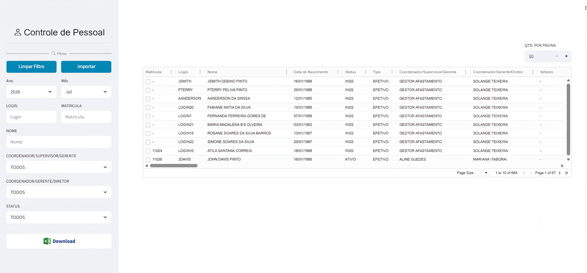
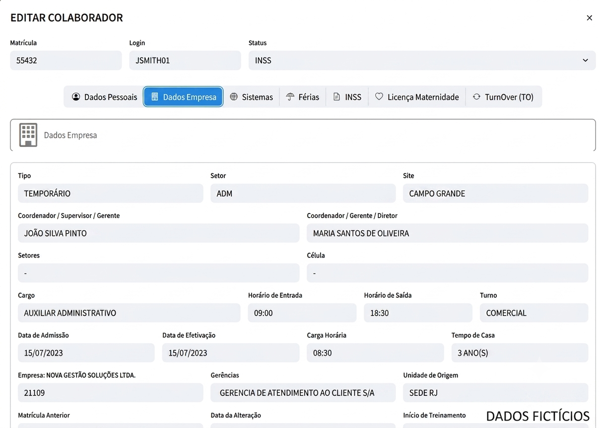

# Controle de Pessoal

## Sobre

Desenvolvimento de uma ferramenta para visualização do cadastro de colaboradores, permitindo a consulta centralizada das informações de todos os profissionais. A solução facilita o acesso aos dados cadastrais e torna a gestão de pessoal mais prática e eficiente.

---

## Tecnologias utilizadas

- Python
- Streamlit
- MySql
- Pandas
- HTML
- CSS

---

## Funcionalidades

- Consulta de colaboradores
- Pesquisa por matrícula
- Pesquisa por nome
- Visualização dos dados cadastrais

---

## Tela inicial

---

## Dados Cadastrais

---
